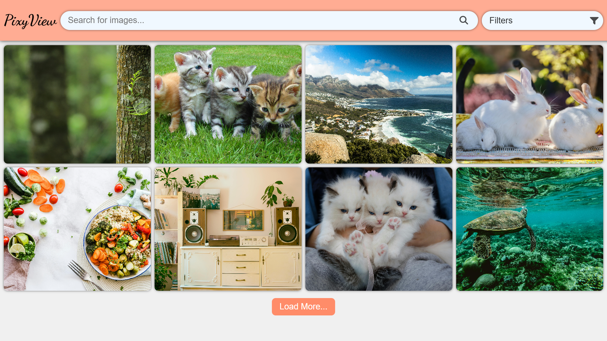

# 🌊 PixyView – Responsive Image Gallery  

PixyView is a clean and modern image gallery web app built with **HTML**, **CSS**, and **JavaScript**.  
It allows users to browse images by category, search for specific ones, and view them in a sleek lightbox with keyboard navigation.  

---

## ✨ Features  
- 📱 **Responsive Design** – Works seamlessly on all devices.  
- 🗂 **Category Filtering** – Quickly view images by category using a dropdown menu.  
- 🔍 **Search Functionality** – Find images instantly by keyword.  
- 🖼 **Lazy Loading** – Improves page performance.  
- ➕ **Load More Button** – Paginated image loading for better UX.  
- 💡 **Lightbox View** – Enlarged image view with:  
  - Next/Previous navigation buttons  
  - Keyboard navigation (Arrow keys + Escape to close)  
- ⚠ **No Results Handling** – Displays a message when no images match the search/filter.  

---

## 🛠 Tech Stack  
- **HTML5** – Structure  
- **CSS3** – Styling & animations  
- **JavaScript (Vanilla)** – Interactivity  

---

## 🚀 Usage  
1. Download or clone this repository.  
2. Open `index.html` in your web browser.  
3. Use the dropdown or search bar to filter images.  
4. Click an image to open it in the lightbox.  
5. Use the on-screen arrows or keyboard to navigate.  

---

## 📷 Preview  

